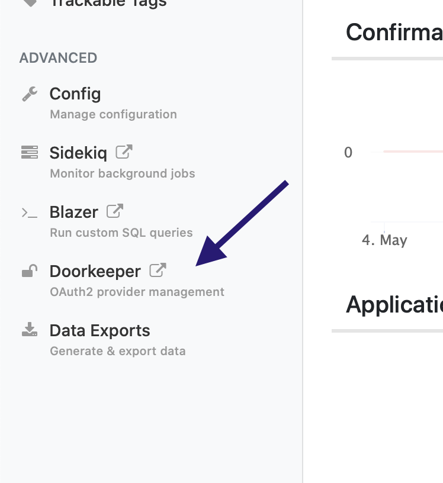
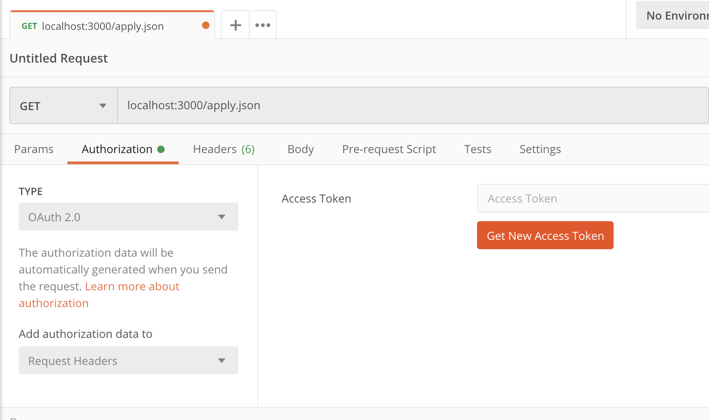
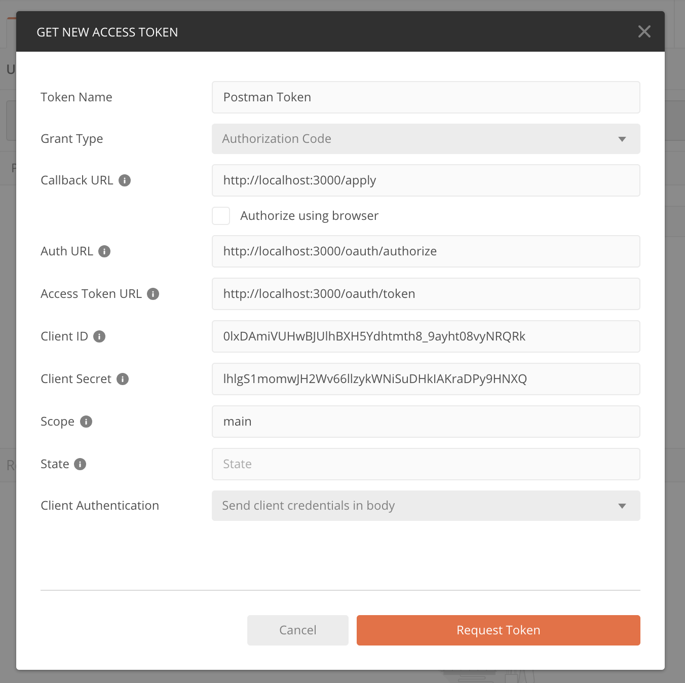
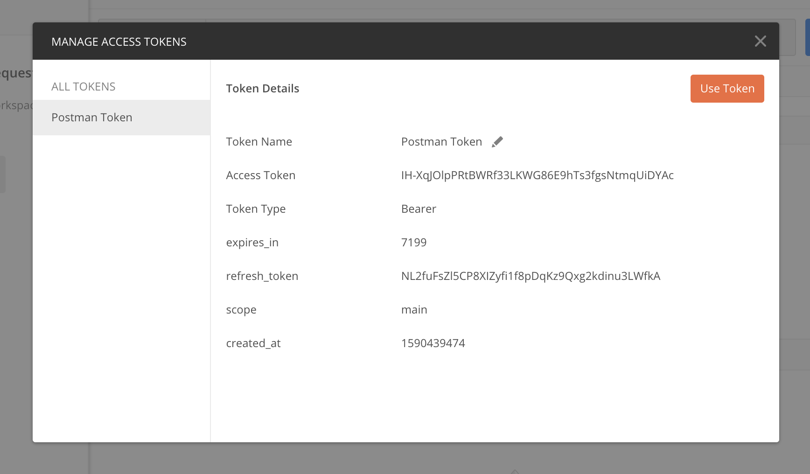
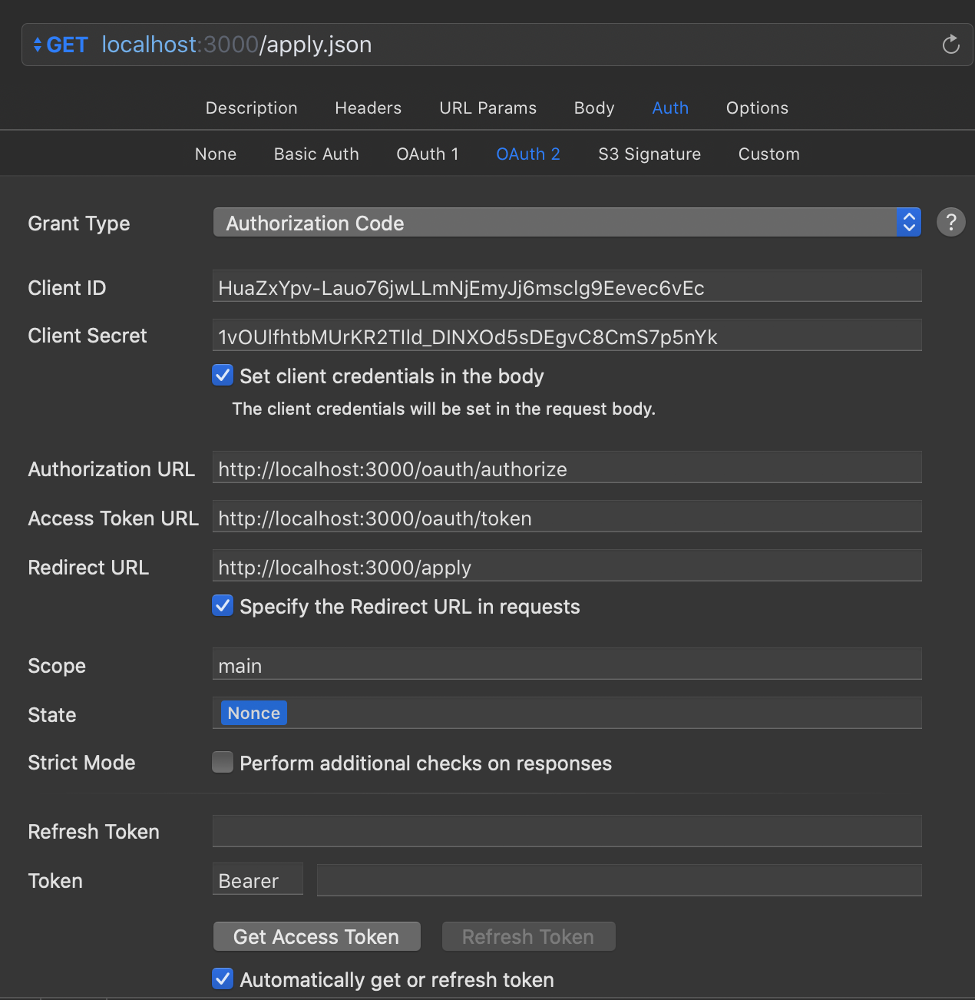

This page will show you how to setup API requests with Postman and Paw. The main goal here is to setup OAuth2 authorization. 

## Applications for API Requests
- [Postman](#initial-setup-with-postman)
- [Paw](#initial-setup-with-paw)

## OAuth2 Notes

- The application only supports `Authorization Code` and `Implicit Grant` authorization methods. It's suggested to use an `implicit` grant for native apps, as they are inherently trusted. 
- In a real application, the callback URL would have a specific scope that's not just `http://`, i.e., `brickhack-ios://` (for BrickHack's iOS application). However Postman would really be confused with that scheme. 
- Client credentails must be sent in the body.
- Browser authorization is currently not supported, at least in Postman. Not sure why! If you discover a reason, please open an Issue on the [hackathon manager repo](https://github.com/codeRIT/hackathon-manager).

## Initial Setup with Postman

This guide assumes you have already setup an admin account on a local hackathon manager install. For more details on this, see the [main README](https://github.com/codeRIT/hackathon-manager#local-development).

Sign in to your admin account, and click "Manage". Then go to the **Doorkeeper** tab on the bottom-left.

On this screen, click "New Application". 

Name it whatever you wish. Set the Redirect URI to `http://localhost:3000/apply`, uncheck `Confidential`, and set a scope to `main`. Then, click `Submit`.

> Note: There is [a bug](https://github.com/doorkeeper-gem/doorkeeper/issues/1307) in the current version of doorkeeper (5.0), where if you do not put a scope, all OAuth requests fail. This scope can be anything as long as it is not empty.

Now, go to Postman and configure the initial request as follows:

Then, click the `Get Access Token` button.

On this screen, fill out the information but with your own keys from the image above.

You should get a popup with the BrickHack sign in screen. Type in your admin credentials and log in.

On the next screen, select `Authorize`:

You should see this resulting screen. On here, select `Use Token`:

That's it! Now you can make authorized requests at whatever permission level your account has.

## Initial Setup with Paw

The process is very similar to above. To save time, here is a screenshot of the `auth` config screen:

To reset your login, remove the dynamic fields in `Refresh Token` and `Token`. If your web login is still cached, try clearing cookies (`Paw > Web Views > Clear Cookies`) and Cache (`Paw > Web Views > Clear Cache`). 

