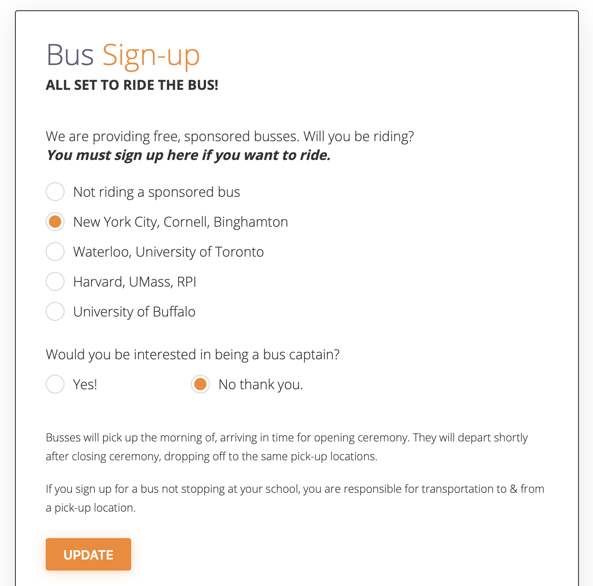
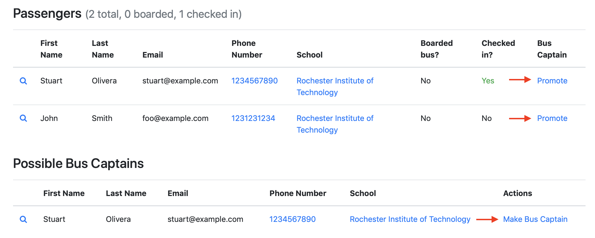

HackathonManager enables you to facilitate bus sign-ups for attendees during the RSVP process.

## Attendee sign-ups

**Attendees can sign up for any available bus list.** This is presented to them during the RSVP process.

By signing up, they reserve one spot on the bus. If a bus fills up, no more attendees will be able to sign up for that bus.



## Bus Captains

Passengers can volunteer to be a captain when signing up for a bus.

Bus captains:

- Have their name, email, and phone number shared with bus passengers
- Can see the full passenger list for their bus
- Can mark passengers as boarded during boarding (mobile-friendly)

### Promoting a passenger to captain status

Any passenger can be promoted to a captain, even if they didn't volunteer (e.g, you've reached out to them directly).

You'll see the option to promote a passenger to being a bus captain, as well as a separate section specifically for people that have volunteered to be captains.

**Upon making someone a captain:**

- Their name, email, and phone number will be visible to passengers
- The new captain will receive an email notification ([this is the default template](https://github.com/codeRIT/hackathon_manager/blob/master/app/views/mailer/bus_captain_confirmation_email.html.erb))



### Boarding flow for bus captains

The day of your hackathon, bus captains will need to know who is allowed on the bus, and mark those that have boarded.

Bus captains should open https://your-hackathon.com/bus_list and sign in. From there, they can view the entire list of passengers.

Tapping/clicking on the checkbox next to each name will mark that passenger as boarded/not boarded.

Example email to a bus captain:

```
Hey [name],

Thanks again for volunteering to be a bus captain! [HackFoo]'s bus to [location] would not be possible without your help, and we greatly appreciate it.

As a bus captain, you are in charge of who does and does not board the bus. It's incredibly important that **only people who are on the registered passenger list may board.** Not only could an extra person take someone else's seat, but they may not have been accepted to the hackathon and/or have not signed proper liability waivers.

To help with this, open https://your-hackathon.com/bus_list on your phone. From there, your bus's full passenger list is shown.

As people board, **tap on the checkbox next to their name** (including yourself). This will mark them as boarded, and will update your "boarded" count for an easy head-count. Once everyone has boarded, do a quick head-count on the bus to make sure these numbers match up.

If you have any questions day-of, don't hesitate to call or text me at [your cell phone number].

Hope to see you soon!

 - [your name]
[your email]
[your cell phone number]
```
