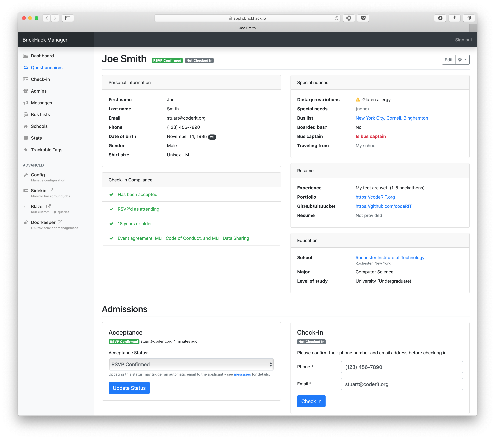

A questionnaire is what an attendee submits **to apply to your hackathon.**

Once a user has created an account, they complete their **questionnaire** with all required info (name, school, etc).

## Questionnaire Questions

### Personal Information

The section of the **questionnaire** that asks the attendee for basic information about themselves.

This includes:

* **First Name** &mdash; The first name of the attendee
* **Last Name** &mdash; The attendee's last name
* **Email** &mdash; The attendee's preffered email
* **Phone** &mdash; The attendee's preffered phone to be reached at
* **Date of Birth** &mdash; The date of birth of the attendee
* **School** &mdash; The school the attendee is currently attending
* **Level of Study** &mdash; The attendee's grade level (undergraduate, postgraduate, etc)
* **Major** &mdash; The attendee's intended major
* **Gender** &mdash; The attendee's sexual orientation

### Travel Information

This is the part of the questionaire that asks the attendee how they will be arriving to your **hackathon**.

This includes four sections:

* **Travelling from school** &mdash; Check box indicating whether or not the attendee plans to travel from their school
* **Bus List** &mdash; The sponsored bus that the attendee wishes to travel in to get to your hackathon (if the attendee does not wish to ride a bus, there is an option not to apply to one)
* **Boarded Bus** &mdash; Check box indicating whether or not the attendee has chosen to take another unsponsored bus
* **Bus Captain** &mdash; Another check box indicating whether or not the attendee plans to drive a bus of other attendees to the event

### Special Notices

This section of the **questionaire** goes over the attendee's specific needs and restrictions.

This includes:

* **Shirt Size** &mdash; Attendee's are able to choose from a drop down menu of different shirt sizes in both women and unisex sizes
* **Dietary Restrcitions** &mdash; A list of specific allergies or other food sensitivities that an attendee might have
* **Special Needs** &mdash; A list of more specific needs an attendee needs addressing before arriving to the event.

### Resume

The part of the **questionaire** that asks attendee's for their background and experience in prior hackathon events.

Required questions include:

* **Why Hackathon?** &mdash; This is where attendee's are able to type out why they would like to particpate in your hackathon event
* **Experience** &mdash; Attendees are able to choose between three levels: First hackathon, 1-5th hackathon, and 6th hackathon or above
* **Interest** &mdash; Attendees are able to choose whether they're intrested in **Design**, **Software**, **Hardware** or **Everything**
* **Graduation Year** &mdash; A field that asks attendees when they are planning to graduate.
* **Race/Ethnicity** &mdash; A field where attendees are able to choose a race/ethnicity that best fits them (also able to not answer if they prefer not to)

Optional fields include:

* **Resume** &mdash; Attendees are able to submit a file of their resume here
* **Portfolio Link** &mdash; A link to a portofolio of different projects the attendee had previously worked on
* **GitHub/GitLab/Bitbucket** &mdash; Link to the attendee's GitHub/GitLab/Bitbucket profile
* **Permission to share resume** &mdash; Simple check box asking permission to share resume with other employers

